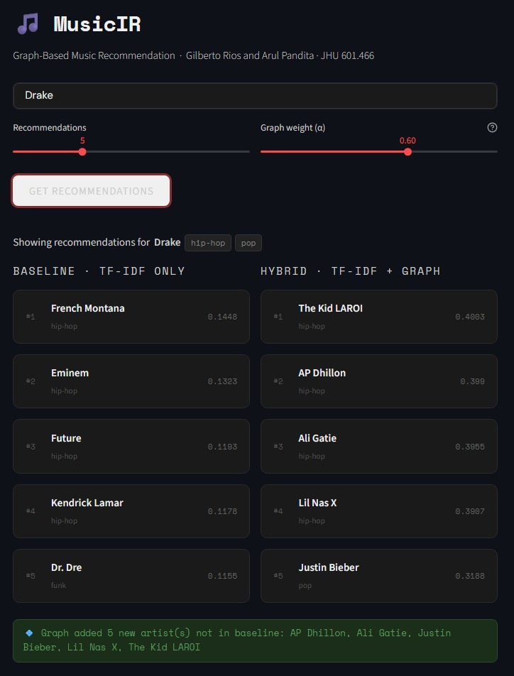
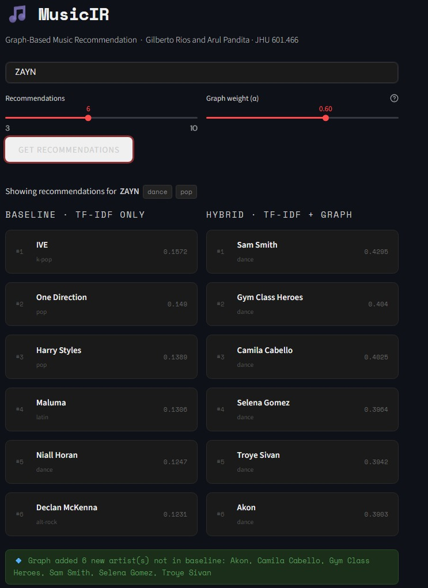

# 🎵 MusicIR — Graph-Based Music Recommendation System

> Hybrid music recommendation system combining TF-IDF Information Retrieval,
> graph-based similarity, and a real-world web scraping agent.
> Built for EN.601.466 — Information Retrieval and Web Agents,
> Johns Hopkins University, May 2026.

---

## 📌 Overview

MusicIR recommends music artists by blending two complementary perspectives:

- **Semantic similarity** — TF-IDF vector representations of artist biographies,
  scored by cosine similarity
- **Structural similarity** — a music knowledge graph scored by the
  Jaccard coefficient on artist neighborhoods

A web scraping agent automatically collects the artist biography text from
Wikipedia (with Last.fm as fallback), making the system grounded in
real-world, human-written descriptions rather than just audio features.

The hybrid scoring formula is:

```
score(j) = α × cosine_sim(query, j) + (1 − α) × jaccard(query, j)
```

The parameter α is adjustable in real time via a slider in the Streamlit
interface, letting users tune the balance between semantic and structural
similarity.

---

## 📊 Results

Evaluated using **Precision@5** on 149 artists, with ground truth derived
automatically from shared genre labels in the Spotify dataset.

| Model | Precision@5 |
|---|---|
| Baseline (TF-IDF cosine only) | 44.6% |
| **Hybrid (TF-IDF + Graph)** | **92.6%** |

> **+48.1 percentage point improvement** from adding the graph layer.

---

## 🖥️ Demo

### Query: Drake (hip-hop, pop)



The hybrid model introduced 5 artists not in the baseline:
The Kid LAROI, AP Dhillon, Ali Gatie, Lil Nas X, Justin Bieber —
all genre-coherent with Drake's hip-hop and pop profile.

### Query: ZAYN (dance, pop)



The hybrid model introduced 6 artists not in the baseline:
Sam Smith, Gym Class Heroes, Camila Cabello, Selena Gomez,
Troye Sivan, Akon — a more genre-homogeneous pop/dance cluster
than the TF-IDF baseline alone.

---

## 🏗️ System Architecture

The pipeline runs in five stages:

```
dataset.csv
    │
    ▼
┌─────────────────────────────┐
│  1. Dataset Initialization  │  114,000 tracks · 114 genres
│     Primary artist extract  │  artist → genre mapping
└─────────────┬───────────────┘
              │
              ▼
┌─────────────────────────────┐
│  2. Web Scraping Agent      │  Wikipedia REST API (primary)
│     music_scraper.py        │  Last.fm (fallback)
│                             │  Music keyword validation
│                             │  1.5s crawl delay · 154 artists
└─────────────┬───────────────┘
              │
              ▼
┌─────────────────────────────┐
│  3. TF-IDF Vectorization    │  max_features = 5,000
│                             │  sublinear_tf = True
│                             │  stop_words = english
│                             │  → 154×154 cosine similarity matrix
└─────────────┬───────────────┘
              │
              ▼
┌─────────────────────────────┐
│  4. Graph Construction      │  154 nodes (artists)
│                             │  Genre edges     weight = 0.6
│                             │  Similarity edges weight = cosine score
│                             │  Threshold = 0.12 · 2,514 edges total
└─────────────┬───────────────┘
              │
              ▼
┌─────────────────────────────┐
│  5. Hybrid Recommendation   │  α × TF-IDF + (1−α) × Jaccard
│     Engine                  │  α tunable via UI slider (default 0.6)
└─────────────────────────────┘
```

---

## 🚀 How to Run

### 1. Install dependencies

```bash
pip install pandas numpy scikit-learn networkx streamlit requests beautifulsoup4
```

### 2. Required files (same directory as app.py)

| File | Description |
|---|---|
| `dataset.csv` | Spotify Tracks Dataset (~20MB, ~114K tracks) |
| `artist_metadata.csv` | Raw scraped artist bios (154 artists) |
| `artist_metadata_clean.csv` | Preprocessed artist bios ready for TF-IDF |
| `baseline_similarity.npy` | Precomputed 154×154 cosine similarity matrix |

### 3. Launch the app

```bash
streamlit run app.py
```

### 4. Using the app

1. Type an artist name (e.g. *Drake*, *ZAYN*, *Bad Bunny*)
2. Select the number of recommendations K (3–10)
3. Adjust α — the balance between TF-IDF and graph (default 0.6)
4. Click **GET RECOMMENDATIONS**

The app shows the **Baseline** (TF-IDF only) and **Hybrid** (TF-IDF + Graph)
results side by side, with genre badges per artist and a callout showing
which artists the graph added that the baseline missed.

---

## 🔄 Rebuilding from Scratch (Notebook)

To re-scrape all bios or recompute the similarity matrix, open
`IR_and_WA_Project.ipynb` and run cells in order:

| Cell | What it does |
|---|---|
| Cell 0 | Web scraping agent — queries Wikipedia and Last.fm, saves `artist_metadata_clean.csv` |
| Cell 1 | TF-IDF vectorization — builds vector model, saves `baseline_similarity.npy` |
| Cell 2 | Graph construction — builds the music knowledge graph |
| Cell 3 | Evaluation — computes Precision@5 for both models |

---

## 🌐 Web Scraping Agent

The scraper (`music_scraper.py`) targets the top 154 artists by mean
track popularity from the Spotify dataset. For each artist it:

1. Queries the **Wikipedia REST summary API**
2. Falls back to **`(musician)`** disambiguation if needed
3. Falls back to **`(band)`** disambiguation if needed
4. Falls back to **Last.fm** as a final option

Every scraped bio is validated with:
- A **music keyword set** (singer, rapper, album, genre, record label, etc.)
- A **bad-pattern rejection list** that catches wrong-topic pages
  (e.g. *Future* → "the time after the past", *Train* → "a series of connected vehicles")

A **1.5-second crawl delay** between requests follows polite robot citizenship norms.

---

## 📈 Alpha Sensitivity

| α | TF-IDF weight | Graph weight | Behavior |
|---|---|---|---|
| 0.1 | 10% | 90% | Genre-dominated, high diversity |
| 0.4 | 40% | 60% | Graph-leaning, good genre coverage |
| **0.6** | **60%** | **40%** | **Best Precision@5 (default)** |
| 0.9 | 90% | 10% | Near-identical to baseline |

---

## ⚙️ Tech Stack

| Layer | Tools |
|---|---|
| Language | Python 3.x |
| IR / ML | scikit-learn (TF-IDF, cosine similarity) |
| Graph | NetworkX (graph construction, Jaccard coefficient) |
| Web scraping | requests, BeautifulSoup4, Wikipedia REST API |
| Interface | Streamlit |
| Data | Spotify Tracks Dataset (Kaggle) |

---

## 📁 Repository Structure

```
MusicIR/
├── app.py                      # Streamlit application (entry point)
├── music_scraper.py            # Web scraping agent
├── IR_and_WA_Project.ipynb     # Full pipeline notebook
├── artist_metadata.csv         # Raw scraped artist bios
├── artist_metadata_clean.csv   # Preprocessed artist bios for TF-IDF
├── baseline_similarity.npy     # Precomputed similarity matrix
├── dataset.csv                 # Spotify Tracks Dataset
├── Report.pdf                  # Full project report
└── screenshots/
    ├── drake_query.png
    └── zayn_query.png
```

---

## ⚠️ Limitations

- Corpus limited to 154 artists — a larger corpus would yield a denser graph
- TF-IDF does not capture deep semantic meaning (no word context)
- Graph edge weights are heuristic, not learned
- No collaborative filtering or user listening history
- Ground truth uses genre overlap as a proxy for relevance

---

## 🔮 Future Work

- Replace TF-IDF with sentence embeddings (BERT, sentence-transformers)
- Learn edge weights from Last.fm co-play counts
- Add Graph Neural Network (GNN) layers for multi-hop propagation
- Incorporate collaborative filtering from user listening data
- Expand corpus to 500–1,000 artists
- Deploy as a persistent web service

---

## 👥 Authors

**Arul Pandita & Gilberto Rios** — Data Science, Applied Mathematics and Statistics, Johns Hopkins University

EN.601.466 — Information Retrieval and Web Agents  
Professor David Yarowsky · May 2026
